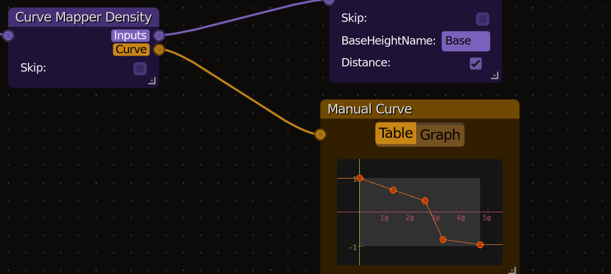

  <h1>Cam Hytale ANE</h1>
  
<b>A custom, cross-platform Asset Node editor for Hytale, primarily for worldgen v2</b>

> [!WARNING]
> PLEASE READ: This is an alpha release, it is provided as-is, please take care to properly version control or backup any files you may be editing.

## Current Status:
Alpha, usable but not very stable

### What works:
* WorldGen Asset Node workspaces (Biome, Density, BlockMask, Assignments)
* Loading a WorldGen Asset Node JSON file and saving (keep backups if saving over your work!)
* Adding, editing, removing nodes etc. Changing graph connections.
* Cutting connections by drawing a freeform line (ctr+right click)
* Remembering favorites and recently used directories accross app restarts
* Windows and Linux support (unsigned Mac build is available, mileage may vary)

### What doesn't work:
* Doesn't yet work with non-worldgen Workspaces, only those that start with "HytaleGenerator - "
* Node Comments, Separate Comments, and Groups are not yet implemented
* Customizable Theme Colors do not persist across sessions yet
* Custom Node Titles are supported but there's no way to rename nodes in the editor itself yet

### Unique Features:
* Custom Manual Curve Editor with a built-in visual editor

* Easily customizable colors for every type of node
* Auto-add node if there is only one possible node for the connection type you dragged out
* Stay tuned for more

